# 🚀 DevTrack AI

An AI-powered Developer Career Platform built to help students and developers manage their entire career journey in one place.

DevTrack AI combines Resume Building, ATS Analysis, Portfolio Management, Project Tracking, DSA Tracking, AI Interview Preparation, Career Analytics, and AI Career Coaching into a modern SaaS platform.

🔗 **Live Demo:** Coming Soon

---

# 📖 About the Project

DevTrack AI is a complete full-stack SaaS platform designed for aspiring software engineers and developers.

Instead of using multiple websites for resumes, portfolios, DSA tracking, interview preparation, and career management, DevTrack AI provides everything inside a single platform powered by Artificial Intelligence.

The platform helps developers:

- Build professional resumes
- Analyze ATS compatibility
- Manage projects
- Track DSA progress
- Practice AI interviews
- Build portfolios
- Monitor career growth
- Receive AI career guidance

This project was built to strengthen my skills in Full Stack Development, AI Integration, Authentication, Cloud Deployment, Database Design, and scalable SaaS architecture.

---

# ✨ Features

## 👤 Authentication

- Secure Registration & Login
- Better Auth Authentication
- Session Management
- Protected Routes
- Secure Cookie Authentication
- Password Reset
- Email Verification
- User Profile Management

---

## 📄 Resume Builder

- Professional Resume Builder
- Dynamic Resume Sections
- Education Management
- Experience Management
- Skills Section
- Projects Section
- Certificates
- Resume Preview
- Resume Export
- Resume Version Management

---

## 📑 ATS Analyzer

- AI Resume Analysis
- ATS Score
- Keyword Detection
- Missing Skills Analysis
- Resume Suggestions
- Resume Improvement Tips

---

## 💼 Portfolio Builder

- Portfolio Generator
- Project Showcase
- Skills Display
- Social Links
- Personal Branding
- Portfolio Customization

---

## 📁 Project Tracker

- Add Projects
- Track Progress
- Task Management
- Notes
- Resources
- Attachments
- Completion Tracking

---

## 💻 DSA Tracker

- Problem Tracking
- Difficulty Levels
- Topic Management
- Revision Scheduler
- Progress Analytics
- Daily Streaks

---

## 🎤 AI Interview Preparation

- Mock Interviews
- AI Feedback
- Technical Questions
- HR Questions
- Performance Reports
- Interview History

---

## 🤖 AI Career Coach

Powered by Google Gemini AI

- Career Guidance
- Resume Suggestions
- Project Recommendations
- Learning Roadmaps
- Interview Tips
- Coding Guidance

---

## 📊 Analytics Dashboard

- Career Score
- Resume Statistics
- Project Progress
- DSA Progress
- Interview Performance
- Activity Timeline

---

## ⚙️ Settings

- Profile Settings
- Theme Settings
- Security Settings
- Account Preferences
- Notification Settings

---

# 🎨 User Experience

- Modern UI
- Mobile Responsive
- Dark Mode
- Beautiful Dashboard
- Fast Navigation
- Toast Notifications
- Loading Skeletons
- Smooth Animations

---

# 🔒 Security

- Better Auth
- Protected APIs
- Secure Cookies
- JWT Sessions
- Password Hashing
- Request Validation
- Rate Limiting
- Helmet Security
- Input Validation using Zod

---

# 🛠 Tech Stack

## Frontend

- Next.js 14
- React
- TypeScript
- Tailwind CSS
- React Hook Form
- React Query
- Zod
- Axios

---

## Backend

- Node.js
- Express.js
- TypeScript
- Better Auth

---

## Database

- PostgreSQL
- Neon Database
- Drizzle ORM

---

## AI

- Google Gemini AI

---

## Media Storage

- Cloudinary

---

## Email

- Resend

---

## Deployment

- Vercel (Frontend)
- Render (Backend)
- Neon (Database)

---

# 📸 Screenshots

## 🏠 Home & Features

| Home | Features |
|------|----------|
| 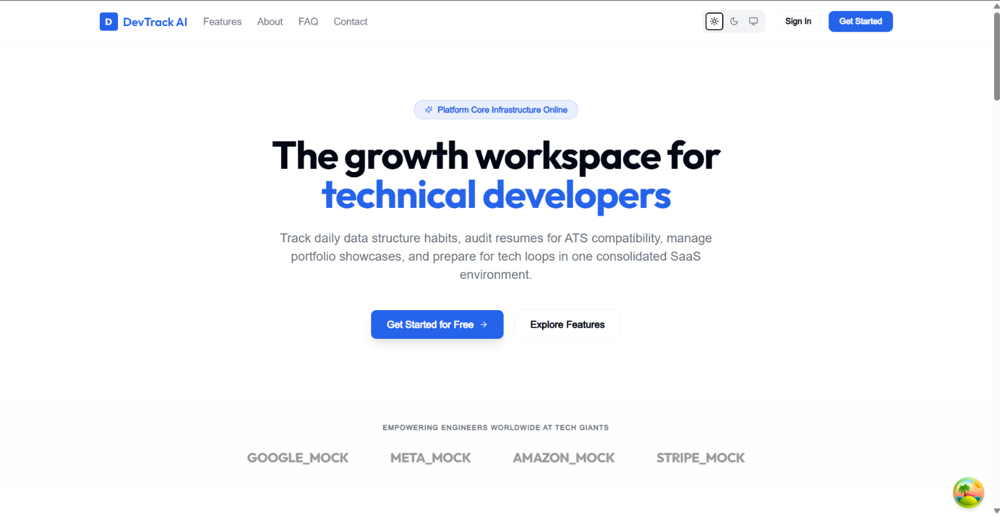 | 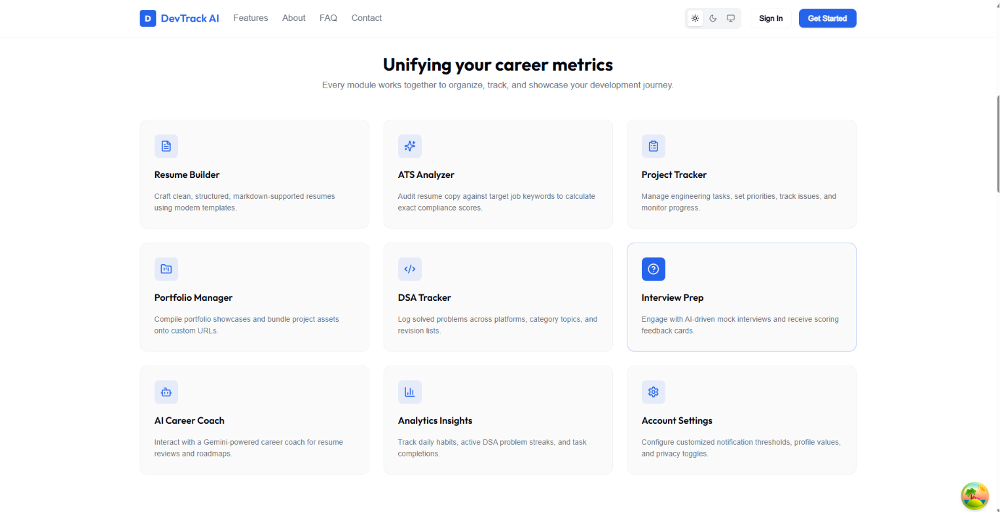 |

---

## 📖 About & Register

| About | Register |
|--------|----------|
| 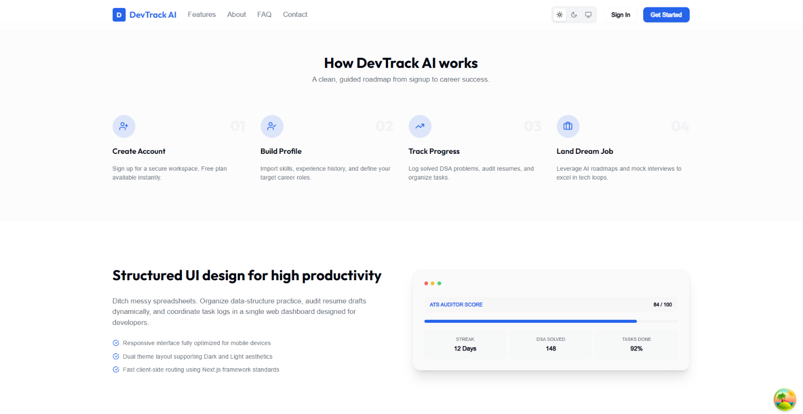 | 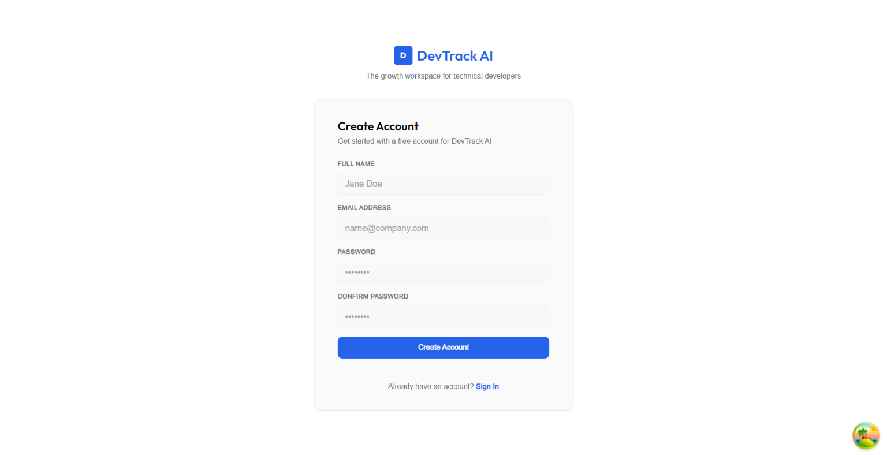 |

---

## 📊 Dashboard & Profile

| Dashboard | Profile |
|-----------|---------|
| 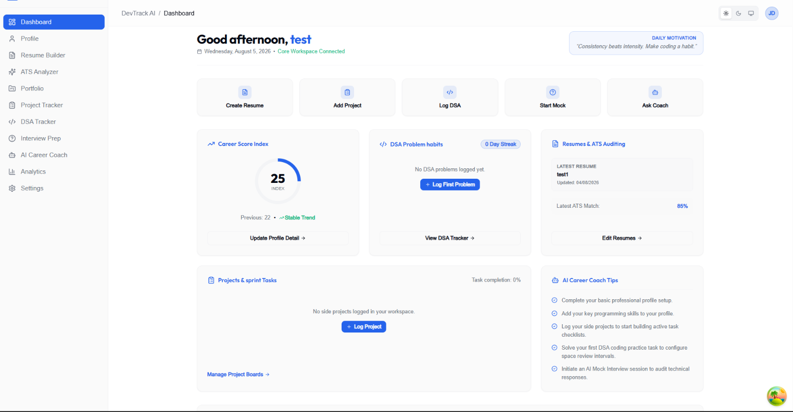 | 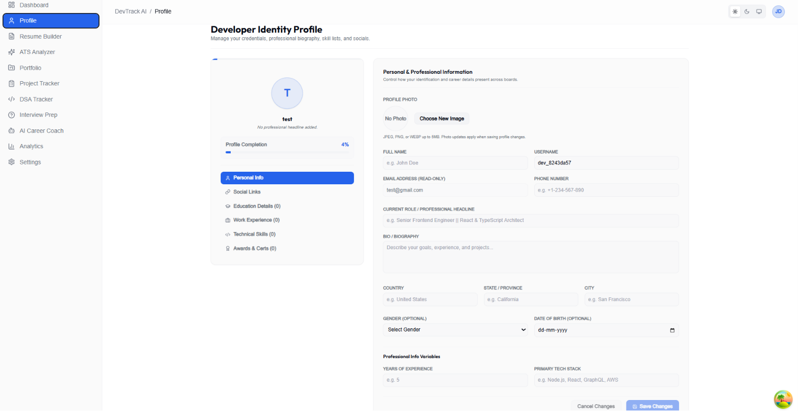 |

---

## 📄 Resume Builder & ATS Analyzer

| Resume Builder | ATS Analyzer |
|----------------|--------------|
| 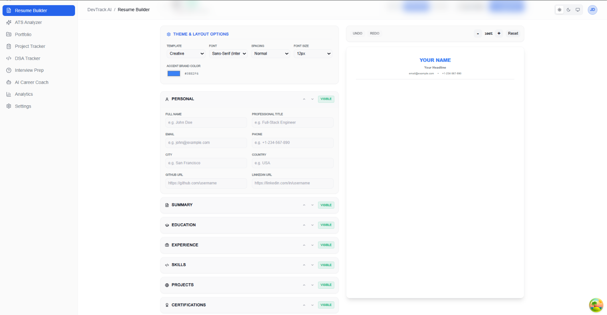 | 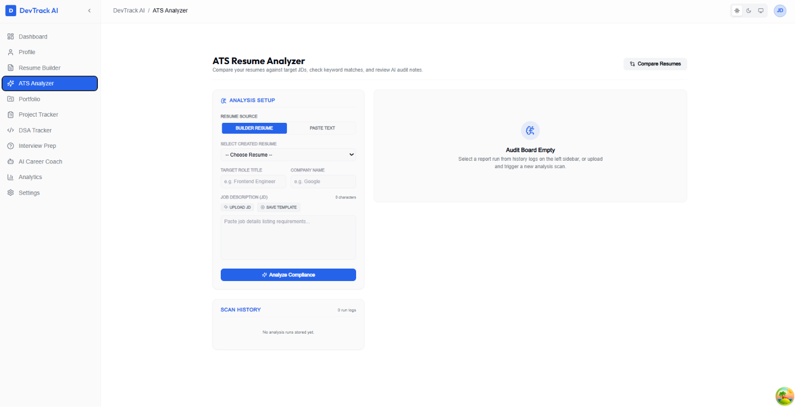 |

---

## 💼 Portfolio & Project Tracker

| Portfolio | Project Tracker |
|------------|-----------------|
| 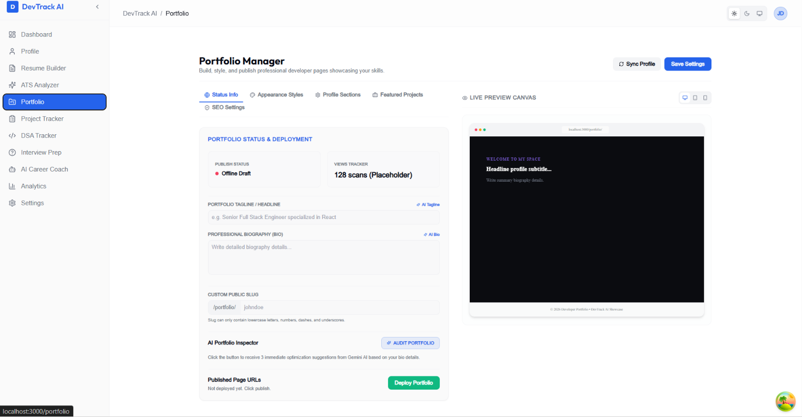 | 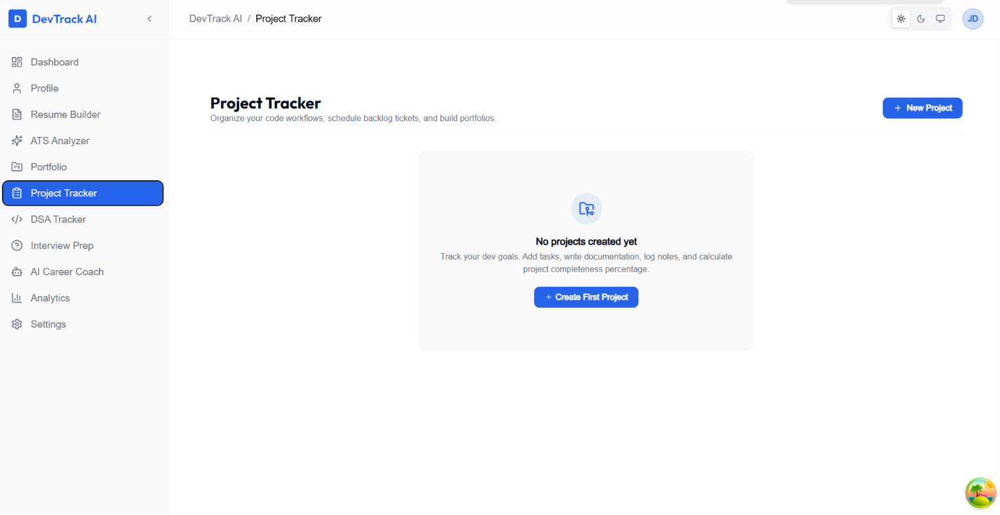 |

---

## 💻 DSA Tracker & Interview Prep

| DSA Tracker | Interview Prep |
|-------------|----------------|
| 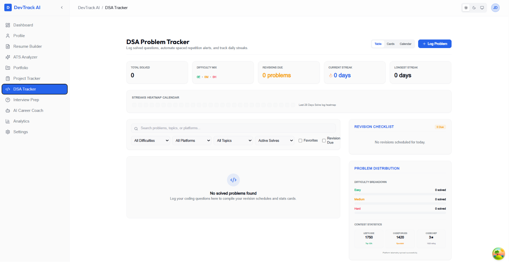 | 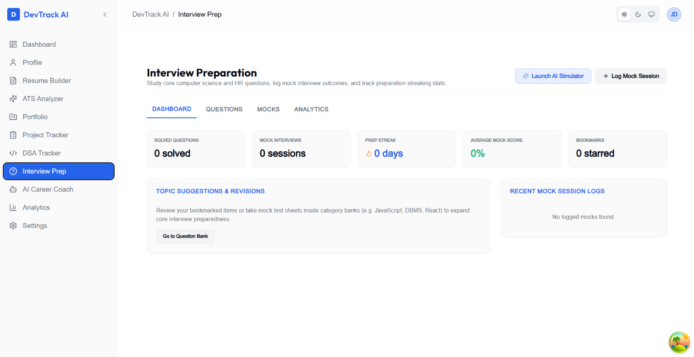 |

---

## 🤖 AI Career Coach & Analytics

| AI Career Coach | Analytics |
|-----------------|-----------|
| 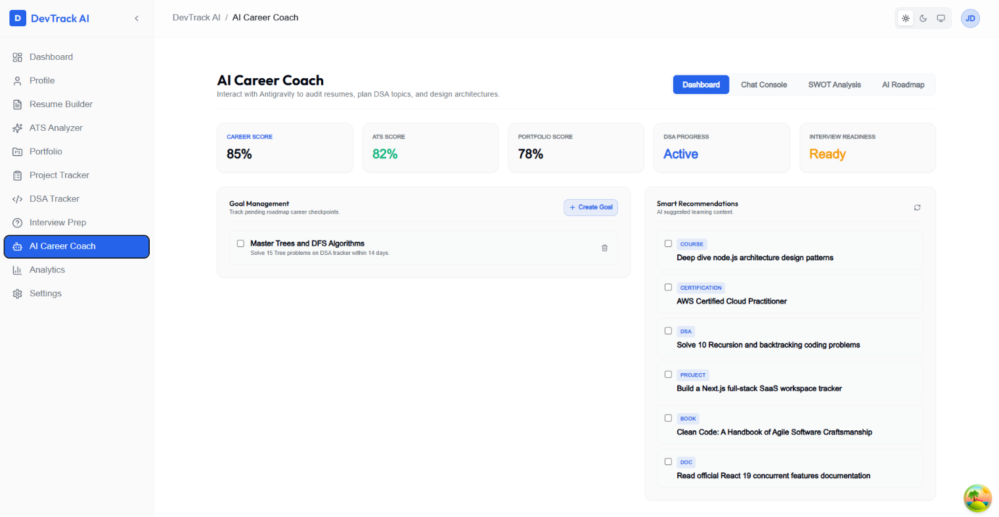 | 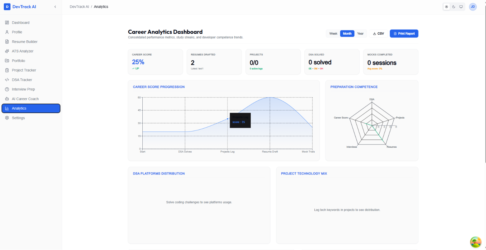 |

---

## ⚙️ Settings & Dark Mode

| Settings | Dark Mode |
|----------|-----------|
| 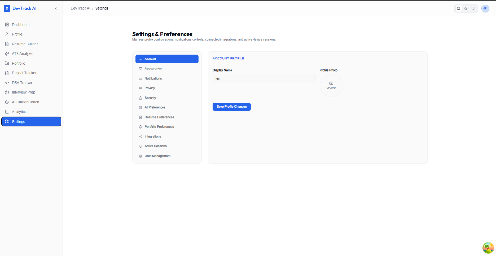 | 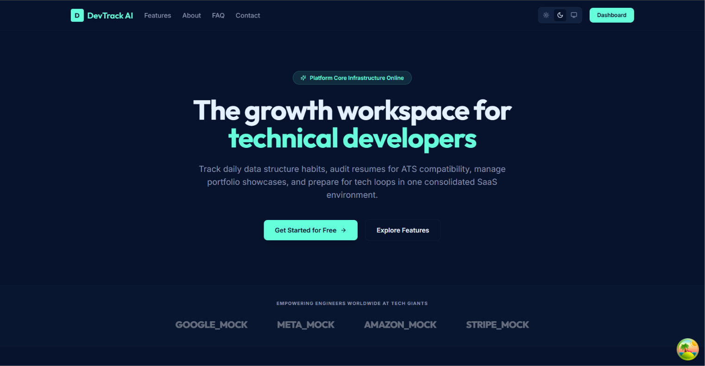 |

---

## 📱 Mobile Preview

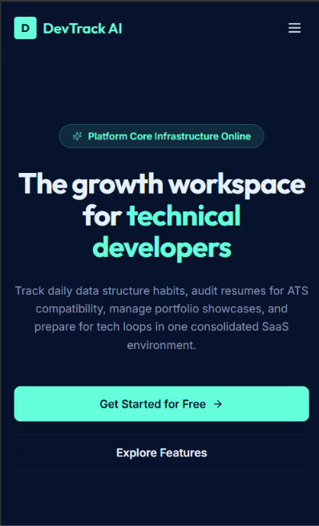

---

# 📂 Project Structure

```text
devtrack-ai
│
├── client/
│   ├── app/
│   ├── components/
│   ├── hooks/
│   ├── services/
│   └── styles/
│
├── server/
│   ├── src/
│   │   ├── auth/
│   │   ├── controllers/
│   │   ├── routes/
│   │   ├── services/
│   │   ├── db/
│   │   ├── middleware/
│   │   └── validations/
│
├── shared/
│
├── screenshots/
│
└── README.md
```

---

# ⚙️ Installation

## Clone the Repository

```bash
git clone https://github.com/Pulipati-Rahul/devtrack-ai.git
```

## Navigate into the Project

```bash
cd devtrack-ai
```

## Install Dependencies

```bash
npm install
```

## Configure Environment Variables

Create:

```
server/.env
```

Fill in:

- DATABASE_URL
- BETTER_AUTH_SECRET
- BETTER_AUTH_URL
- GEMINI_API_KEY
- CLOUDINARY credentials
- RESEND credentials

---

# ▶️ Running the Project

```bash
npm run dev
```

Frontend

```
http://localhost:3000
```

Backend

```
http://localhost:5000
```

---

# 🌍 Deployment

Frontend

- Vercel

Backend

- Render

Database

- Neon PostgreSQL

Media Storage

- Cloudinary

AI

- Google Gemini

Email

- Resend

---

# 💡 What I Learned

Building DevTrack AI helped me gain practical experience in:

- Full Stack Development
- Next.js App Router
- TypeScript
- REST API Development
- Authentication with Better Auth
- PostgreSQL Database Design
- Drizzle ORM
- AI Integration
- Cloudinary
- Email Services
- Production Deployment
- SaaS Architecture
- Secure Backend Development
- Git & GitHub Workflow
- Responsive UI Design
- Performance Optimization

---

# 🚀 Future Improvements

- AI Resume Generator
- AI Portfolio Generator
- AI Roadmap Generator
- Team Collaboration
- Calendar Integration
- GitHub Integration
- LinkedIn Integration
- Coding Contest Tracker
- Company Dashboard
- Admin Analytics
- Resume Templates
- AI Cover Letter Generator
- Job Tracker
- Internship Tracker
- Mobile App

---

# 👨‍💻 Author

**Pulipati Rahul**

Full Stack Developer

### GitHub

https://github.com/Pulipati-Rahul

### LinkedIn

https://www.linkedin.com/in/pulipatirahul

### Portfolio

Coming Soon

---

# ⭐ Support

If you found this project useful, please consider giving it a ⭐ on GitHub.

It motivates me to continue building high-quality open-source software.

---

## 🚀 Built with ❤️ using Next.js, TypeScript, Node.js, PostgreSQL, Drizzle ORM, Better Auth & Google Gemini AI.
